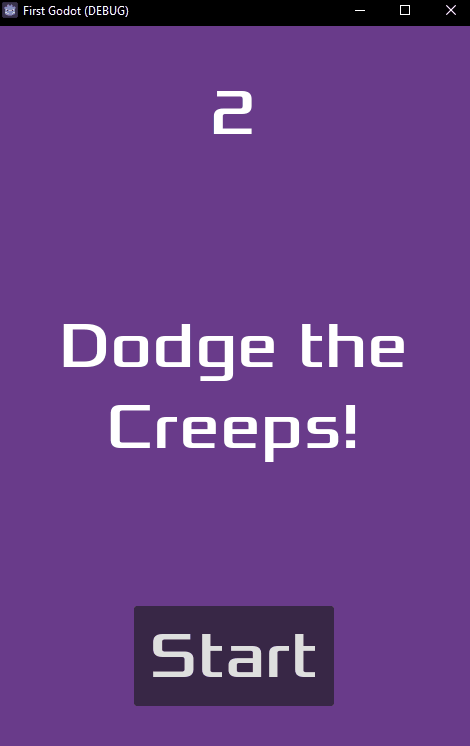
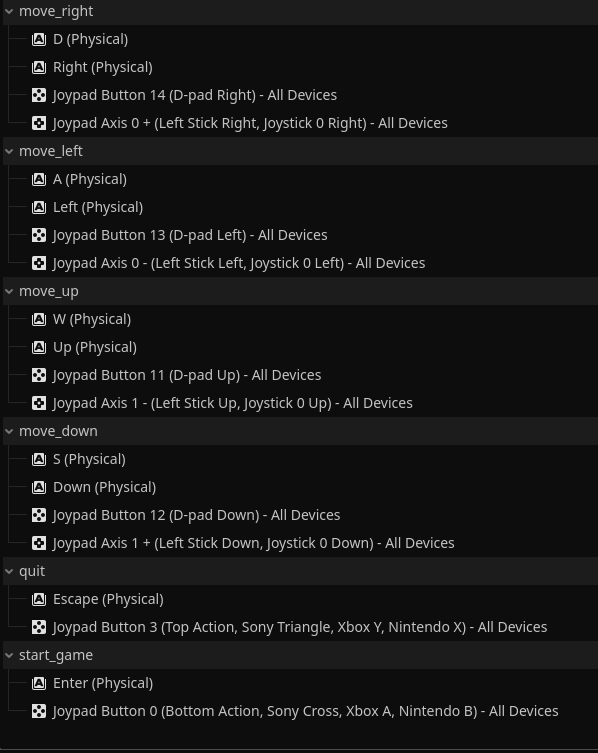

# Godot-.NET
My implementations of Godot's getting started projects, translated from GDScript to C# .NET and rewritten for efficiency. 

## The gist
I noticed most of Godot's tutorials are for GDScript because it is approachable for beginners to write code quickly; however, as projects scale I believe C# with IDE integration (e.g. Visual Studio) could make development time faster due to the enhanced debugging and refactoring capabilities. I implemented Godot's getting started tutorials in C# to provide samples of its use in Godot, rewriting them for efficiency by removing repeated node retrieval and instead caching references to frequently called or created nodes.

## Getting Started 2D

<a href="https://github.com/nicholaswile/Godot-.NET/tree/main/2d/src">Code</a> | <a href = "https://docs.godotengine.org/en/stable/getting_started/first_2d_game/index.html">Reference</a>

I only provide the new C# code, the assets are available on the Godot reference link. You'll have to implement the sprite animations, input processing, and HUD in Godot's editor. For input, I used the following mappings for keyboard and USB controller:

## Getting Started 3D
<a href="#">Code</a> | <a href = "https://docs.godotengine.org/en/stable/getting_started/first_3d_game/">Reference</a>

This is a work in progress. The C# files will be added once completed.
